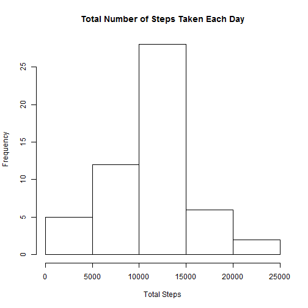
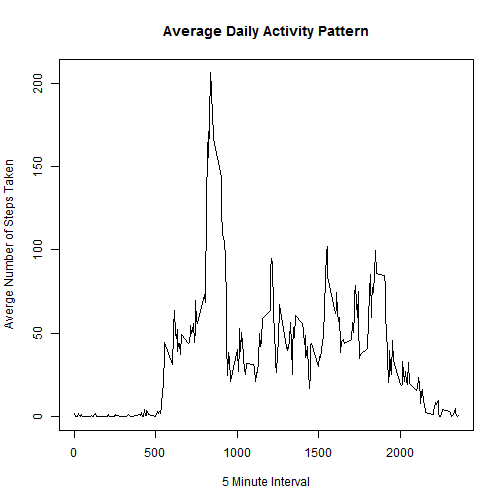
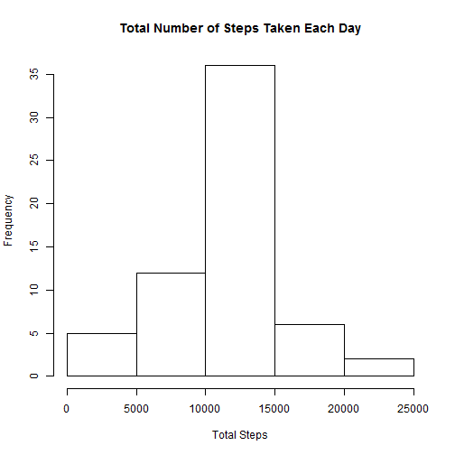
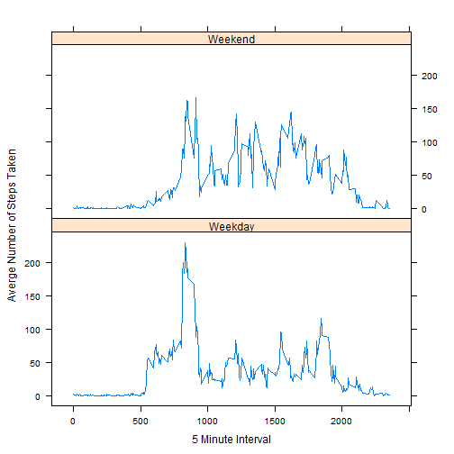

<b>by Chris Hartfield</b>

## Introduction

It is now possible to collect a large amount of data about personal movement using activity monitoring devices such as a Fitbit, Nike Fuelband, or Jawbone Up. These type of devices are part of the "quantified self" movement - a group of enthusiasts who take measurements about themselves regularly to improve their health, to find patterns in their behavior, or because they are tech geeks. But these data remain under-utilized both because the raw data are hard to obtain and there is a lack of statistical methods and software for processing and interpreting the data.

This assignment makes use of data from a personal activity monitoring device. This device collects data at 5 minute intervals through out the day. The data consists of two months of data from an anonymous individual collected during the months of October and November, 2012 and include the number of steps taken in 5 minute intervals each day.

## Data

The data for this assignment can be downloaded from the course web site:

<b>Dataset:</b> <u>[Activity monitoring data](https://d396qusza40orc.cloudfront.net/repdata%2Fdata%2Factivity.zip "Activity monitoring data")</u> [52K]

The variables included in this dataset are:

<ul>
<li>steps: Number of steps taking in a 5-minute interval (missing values are coded as NA)</li>
<li>date: The date on which the measurement was taken in YYYY-MM-DD format</li>
<li>interval: Identifier for the 5-minute interval in which measurement was taken</li>
</ul>

The dataset is stored in a comma-separated-value (CSV) file and there are a total of 17,568 observations in this dataset.

### Loading and Preprocessing the Data

```r
data.col.classes <- c("numeric"
                      , "Date"
                      , "numeric"
                      )

data <- read.csv("./Data/activity.csv"
                 , colClasses = data.col.classes
                 )

steps.per.day <- aggregate(steps ~ date
                           , data, sum
                           , na.rm=TRUE
                           )
```

### What is mean total number of steps taken per day?

#### Histogram of the total number of steps taken each day

```r
hist(steps.per.day$steps
     , main = "Total Number of Steps Taken Each Day"
     , xlab="Total Steps"
     )
```

 

#### Mean and Median total number of steps taken per day

```r
mean(steps.per.day$steps
     , na.rm=TRUE
     )
```

```
## [1] 10766.19
```

```r
median(steps.per.day$steps
       , na.rm=TRUE
       )
```

```
## [1] 10765
```

### What is the average daily activity pattern?

#### Time Series Plot of the 5-minute interval and the average number of steps taken, averaged across all days


```r
interval.steps <- aggregate(steps ~ interval
                            , data
                            , mean
                            )

plot(interval.steps$interval
     , interval.steps$steps
     , type="l"
     , ylab="Averge Number of Steps Taken"
     , xlab="5 Minute Interval"
     , main="Average Daily Activity Pattern"
     )
```

 

#### Which 5-minute interval, on average across all the days in the dataset, contains the maximum number of steps?

```r
interval.steps[which.max(interval.steps$steps), ]$interval
```

```
## [1] 835
```

### Inputing missing values

#### Total number of missing values in the dataset 

```r
sum(is.na(data))
```

```
## [1] 2304
```

#### Strategy for filling in all of the missing values in the dataset
Replace the missing values with the average number of steps of the corresponding interval


#### New dataset that is equal to the original dataset but with the missing data filled in

```r
steps.per.interval <- aggregate(steps ~ interval
                                , data
                                , mean
                                , na.rm=TRUE
                                )

data2 <- data

for (i in 1:nrow(data2)) {
    if (is.na(data2[i, 1])) {
        interval = data2[i, 3]
        data2[i, 1] = steps.per.interval$steps[which(steps.per.interval$interval==interval)]
    }
}

sum(is.na(data2))
```

```
## [1] 0
```

```r
steps.per.day2 <- aggregate(steps ~ date
                            , data2
                            , sum
                            , na.rm=TRUE
                            )
```

### What is mean total number of steps taken per day?

#### Histogram of the total number of steps taken each day

```r
hist(steps.per.day2$steps
     , main = "Total Number of Steps Taken Each Day"
     , xlab="Total Steps"
     )
```

 

```r
#### New Mean and Median total number of steps taken per day
```

```r
mean(steps.per.day2$steps
     , na.rm=TRUE
     )
```

```
## [1] 10766.19
```

```r
median(steps.per.day2$steps
       , na.rm=TRUE
       )
```

```
## [1] 10766.19
```

#### Do these values differ from the estimates from the first part of the assignment? 

Not really

#### What is the impact of imputing missing data on the estimates of the total daily number of steps?

Replacing the NA's has increased the frequencies of the bins near the mean

### Are there differences in activity patterns between weekdays and weekends?

```r
library(dplyr)

data2 <- data2 %>%
           mutate(dayOfWeek = weekdays(data2$date)
                  , dayType = ifelse(dayOfWeek %in% c("Monday"
                                                      , "Tuesday"
                                                      , "Wednesday"
                                                      , "Thursday"
                                                      , "Friday")
                                                      , "Weekday",
                                        ifelse(dayOfWeek %in% c("Saturday", "Sunday"), "Weekend", NA)
                                    )
                  )

data2$dayType <- factor(data2$dayType)

steps.per.dayType <- data2 %>%
                        group_by(interval, dayType) %>%
                        summarize(steps = mean(steps)) %>%
                        select(interval, dayType, steps)
     

library(lattice)
xyplot(steps ~ interval | dayType
       , data = steps.per.dayType
       , layout = c(1, 2)
       , type = "l"
       , xlab = "5 Minute Interval"
       , ylab = "Averge Number of Steps Taken"
       )  
```

 

#### Whats different between weekend end weekdays?

The activity seems to start latter in the day on weekends and then seems to be more consistent througout the day but with weekdays, the activity ramps up much early and tends to much less throughout the remainder of the day.
